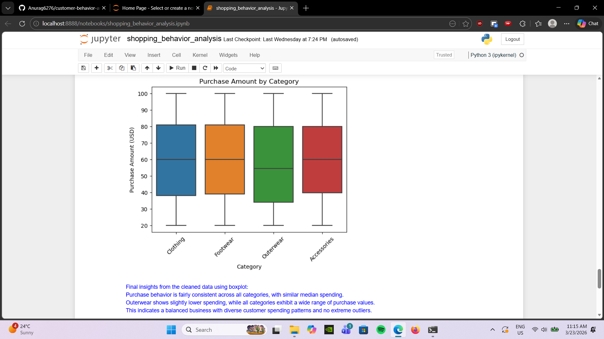
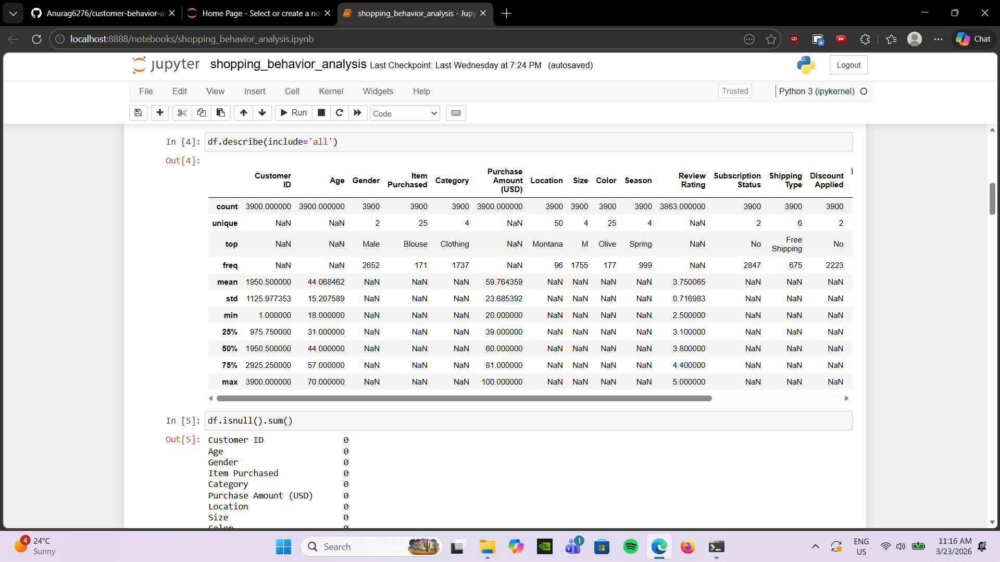
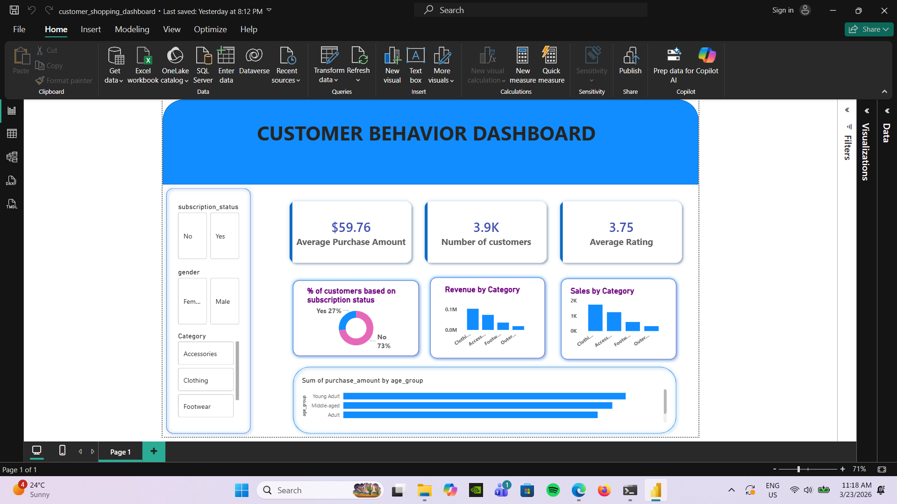
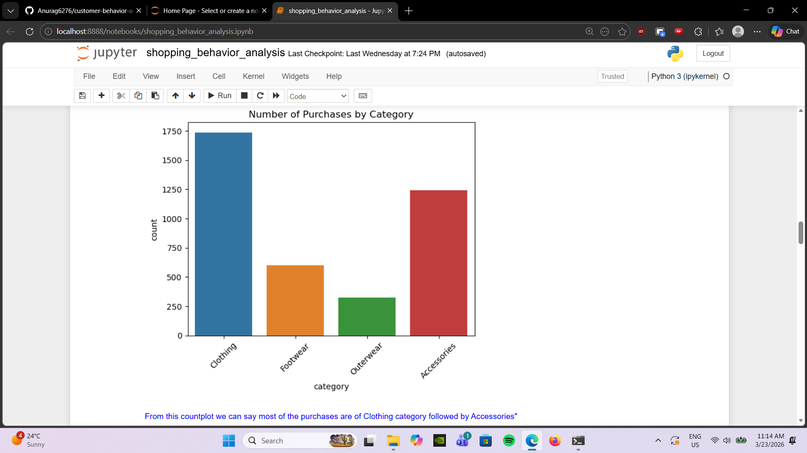

# customer-behavior-analytics 📊

## Overview:

This project focuses on analyzing customer shopping behavior using a complete data analytics workflow. The goal is to extract meaningful insights from raw data by performing data cleaning, exploratory data analysis (EDA), SQL-based querying, and building an interactive dashboard.
The project demonstrates practical skills in Python, SQL, and Power BI, along with effective data storytelling through a presentation.

## Dataset:

The dataset contains customer-related information such as:

- Demographics (age, gender, etc.)
- Purchase behavior
- Product categories
- Transaction details

It is used to understand patterns like customer preferences, spending habits, and trends.

## Tools and Technologies:

- Python (Pandas, NumPy, Matplotlib, Seaborn) – Data loading, cleaning, and EDA
- PostgreSQL – Querying and analyzing structured data
- Power BI – Building interactive dashboards
- Gamma – Creating presentation (PPT)
- Jupyter Notebook – Development environment

## Workflow of Project:

1. Data Loading
 - Imported dataset using Pandas
 - Checked structure, data types, and initial records
2. Data Cleaning
 - Handled missing values
 - Removed duplicates
 - Standardized column formats
 - Corrected inconsistent data
3. Exploratory Data Analysis (EDA)
 - Analyzed distributions and relationships
 - Identified trends in customer behavior
 - Performed statistical summaries
4. Data Visualization
 - Created visual insights using charts such as:
 - Bar plots
 - Box plot
5. SQL Analysis (PostgreSQL)
 - Loaded cleaned data into PostgreSQL
 - Executed queries to extract business insights, such as:
 - Revenue by gender
 - High-value customers
 - Discount impact on purchases
 - Category-wise performance
6. Dashboard Creation (Power BI)
 - Built an interactive dashboard including:
 - KPI cards (Total Sales, Customers, Revenue)
 - Filters (Gender, Category, Age Group)
 - Trend analysis charts
 - Customer segmentation visuals
7. Presentation (Gamma PPT)
 - Summarized key insights
 - Created a clean, story-driven presentation
 - Highlighted business recommendations

 ## Key Results & Insights
 
- Identified top-performing product categories
- Analyzed spending patterns across demographics
- Observed the impact of discounts on purchase behavior
- Recognized high-value customer segments

## Screenshots

